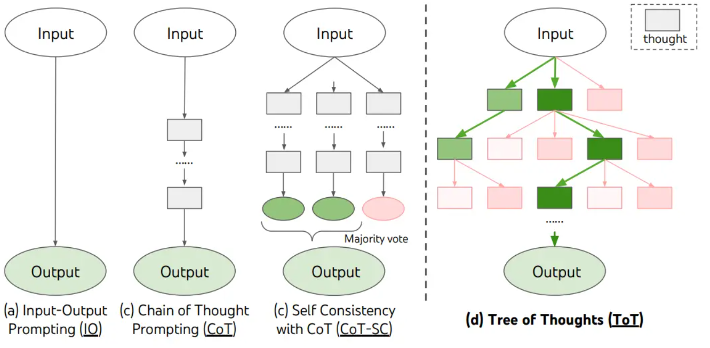

# Prompting Engineer
## temperature和Top_p
Temperature越高，回顾的内容更有随机性和创造性
Top_p也是一样

## Prompt的典型要素
```markdown
# Role
角色：大模型应该扮演什么角色
# Profile
简介
# Background
背景：对角色任务进行项目描述
# Goals
目标：希望达到的效果
# Constrains
约束条件：受到的规则和约束
# Definition
定义：涉及的特定定义
# Tone
语气腔调
# Skills
技能：列出需要的技能/知识
# Examples
例子
# Workflows
自己规定的工作流程
# OutputFormat
输出格式：表格/图片/文字
# Initialization
初始化：任务开始的开场白/状态
```
## Shot
1. 零样本提示（Zero-Shot）（模型能力太强了，零样本基本够用）
2. 少样本提示（Few-Shot）（少量示例，3-5个，模型快速学习，本质是上下文学习）**要明确指出输入和输出**
   示例：
    1.
    ``` Json
    {"role": "user", "content": "这事儿先这样吧，有问题再说。"},
    {"role": "assistant", "content": "暂按当前方案推进，如有问题我们将第一时间沟通调整。"},
    {"role": "user", "content": "你们能不能快点给个回复？"},
    {"role": "assistant", "content": "烦请加快反馈进度，感谢配合。"},
    {"role": "user", "content": "我觉得还行，先试试看呗。"}
     ```
     2.
     ``` markdown
     输入：今天开心
     输出：正面

     输入：今天生气
     输出：负面

     输入：今天难过
     输出：负面

     输入：今天兴奋
     输出：？
    ```
3. 链式思考（COT）
   提供中间推理步骤：
   ```markdown
   [系统指令]
    你是资深定量分析师。用可验证的公式与代入过程给出答案，避免冗长思维过程。

    [输出格式]
    A. 关键假设
    B. 步骤与中间结果（写出公式、代入、计算）
    C. **最终答案**（单位齐全）
    D. 自检（单位/数量级/边界）

    [Few-shot 示例 1]
    Input: 一笔资金现值为 100 万元，年化收益 7%，按年复利，3 年后本利和多少？
    Reasoning:
    - 使用公式：FV = PV × (1+r)^n
    - 代入：FV = 100 × (1.07)^3 = 100 × 1.225043 = 122.5043（万元）
    - 数量级合理：7%复利三年略大于 21%
    Answer: **122.50 万元**

    [Few-shot 示例 2]
    Input: 某项目第一年营收 80 万，之后每年增长 10%，第 5 年营收？
    Reasoning:
    - 使用：R_n = R_1 × (1+g)^{n-1}
    - 代入：R_5 = 80 × (1.10)^4 = 80 × 1.4641 = 117.128（万元）
    - 四舍五入到 0.01
    Answer: **117.13 万元**

    [待求解问题]
    Input: 一个贷款 50 万元，年利率 5%，等额本息 3 年，每月还款额是多少？（给出公式、代入与结果）
    请严格按“输出格式”作答。
   ```
4. 自我一致性（Self-Consistency）
   对抗**幻觉**，多次验算：对同一问题独立采样多次（鼓励不同思路），然后对“最终答案”做多数投票，从而显著提高推理稳定性与准确率。
    1.同样prompt跑多次
    2.投票选出最终结果
    ```python
    import os
    from openai import OpenAI

    client = OpenAI(api_key=os.getenv("DASHSCOPE_API_KEY"),
                    base_url="https://dashscope.aliyuncs.com/compatible-mode/v1")

    prompt2 = """
    现在我70岁了，当我6岁时，我的妹妹是我的年龄的一半。现在我的妹妹多大？请逐步思考
    """

    prompt = """
    Q: 林中有15棵树。林业工人今天将在林中种树。完成后，将有21棵树。林业工人今天种了多少棵树？
    A: 我们从15棵树开始。后来我们有21棵树。差异必须是他们种树的数量。因此，他们必须种了21-15 = 6棵树。答案是6。

    Q: 停车场有3辆汽车，又来了2辆汽车，停车场有多少辆汽车？
    A: 停车场已经有3辆汽车。又来了2辆。现在有3 + 2 = 5辆汽车。答案是5。

    Q: Leah有32块巧克力，她的姐姐有42块。如果他们吃了35块，他们总共还剩多少块？
    A: Leah有32块巧克力，Leah的姐姐有42块。这意味着最初有32 + 42 = 74块巧克力。已经吃了35块。因此，他们总共还剩74-35 = 39块巧克力。答案是39。

    Q: Jason有20个棒棒糖。他给Denny一些棒棒糖。现在Jason只有12个棒棒糖。Jason给Denny多少棒棒糖？
    A: Jason有20个棒棒糖。因为他现在有12个，所以他必须把剩下的给Denny。他给Denny的棒棒糖数量必须是20-12 = 8个棒棒糖。答案是8。

    Q: Shawn有五个玩具。圣诞节，他从他的父母那里得到了两个玩具。他现在有多少个玩具？
    A: 他有5个玩具。他从妈妈那里得到了2个，所以在那之后他有5 + 2 = 7个玩具。然后他从爸爸那里得到了2个，所以总共他有7 + 2 = 9个玩具。答案是9。

    Q: 服务器房间里有9台计算机。从周一到周四，每天都会安装5台计算机。现在服务器房间里有多少台计算机？
    A: 从周一到周四有4天。每天都添加了5台计算机。这意味着总共添加了4 * 5 = 20台计算机。一开始有9台计算机，所以现在有9 + 20 = 29台计算机。答案是29。

    Q: Michael有58个高尔夫球。星期二，他丢失了23个高尔夫球。星期三，他又丢失了2个。星期三结束时他还剩多少个高尔夫球？
    A: Michael最初有58个球。星期二他丢失了23个，所以在那之后他有58-23 = 35个球。星期三他又丢失了2个，所以现在他有35-2 = 33个球。答案是33。

    Q: Olivia有23美元。她用每个3美元的价格买了五个百吉饼。她还剩多少钱？
    A: 她用每个3美元的价格买了5个百吉饼。这意味着她花了15美元。她还剩8美元。

    Q: 现在我70岁了，当我6岁时，我的妹妹是我的一半年龄。现在我的妹妹多大？
    A:
    """

    def get_completion(prompt, model="qwen-plus"):
        messages = [{"role": "user", "content": prompt}]
        response = client.chat.completions.create(
            model=model,
            messages=messages,
            temperature=0,  # 模型输出的随机性，0 表示随机性最小
        )
        return response.choices[0].message.content

    print(get_completion(prompt2))
    print(get_completion(prompt2))
    print('prompt', get_completion(prompt))
    ```
    相当于做了两次对prompt的zero-shot的回复，然后再结合COT和few-shot，最后再输出：
    ```
    Q: 现在我70岁了，当我6岁时，我的妹妹是我的一半年龄。现在我的妹妹多大？
    A:
    ```
结合这三次输出，看到多数答案是67岁，我们可以认为这是更可靠的结果。

5. 思维树（ToT框架）
   

6. 提示词防范和攻击