<style>
img {
    display: block;
    margin: 0 auto;
}
</style>

# 前言
本文的内容主要是针对于Vscode+Github Copilot的组合进行研究其vibe coding的技术，由于两者皆属于微软公司，所以两者协作，融洽性较高。

# 1.GitHub Copilot 核心功能
GitHub Copilot 作为智能助手，能将您的集成开发环境（IDE）转化为智能编码伙伴，直接在代码编辑器中提供**建议与补全功能**。
其核心价值在于理解上下文，并在您输入时提供有意义且相关的代码片段、建议甚至完整方法。本节将重点介绍以下关键功能。
# 1.1 内联代码
你在编写算法时，Copilot 能预测你接下来要写的内容。
**触发方式**：
注释：通过自然语言书写的注释表达您的意图。
<center>
  
</center>

<center>
 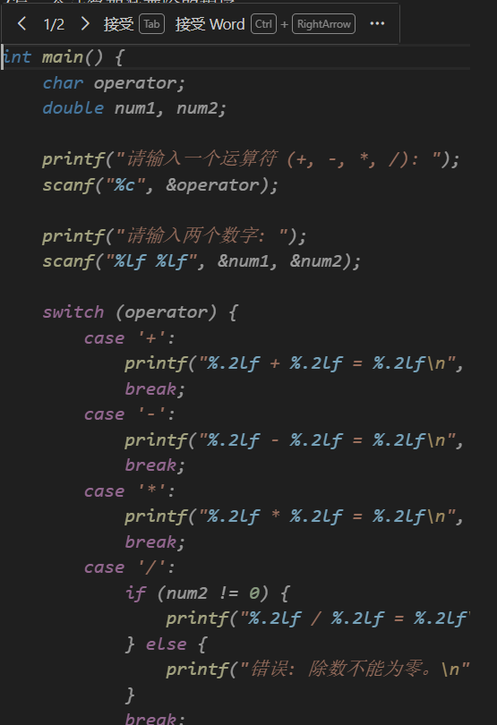
</center
>
方法签名：当您开始编写方法签名时，Copilot能理解上下文并提供代码实现建议。
<center>

</center>

代码上下文：Copilot会分析文件中周边代码，提供有意义的建议/改进方案（最高级，他自己识别）。

# 1.2 智能代码补全与上下文感知建议
GitHub Copilot会在您输入时提供代码补全建议以及提供上下文感知型提示。
这都是Github Copilot分析上下文自发的行为，这边没有提供示例。

# 2.注释提示词工程
## 2.1 用注释、方法名提示
注释：通过自然语言书写的注释表达您的意图。
<center>
  
</center>

<center>
 
</center
>

方法签名：当您开始编写方法签名时，Copilot能理解上下文并提供代码实现建议。
<center>

</center>

## 2.2 利用部分代码提示
提供部分代码片段同样能成为Copilot的优质提示。当存在特定模式需要遵循时，这种方法尤为有效——通过部分代码作为提示，可触发Copilot扩展该模式以完成具体实现细节。
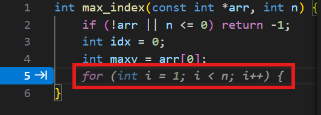


***

# 3.chat模式提示词工程

## 一、什么是提示词工程

提示词工程（Prompt Engineering）指 **以技巧性方式编写提示词**，使大语言模型（LLM）输出更准确、有效和实用的内容。  
它是一个 **持续迭代优化** 的过程。

### 提示词优化六大策略

1.  **编写清晰的说明（Clear Instructions）**
2.  **提供参考文本（Reference Text）**
3.  **将复杂任务拆分（Split Tasks）**
4.  **让模型展示推理过程（Give Time to Think）**
5.  **使用外部工具（Use Tools）**
6.  **系统性测试优化（Test Systematically）**

***

## 二、AI 提示词工程师的核心能力

1.  **业务理解能力**
2.  **AI 原理认知能力**
3.  **持续稳定输出能力**

***

## 三、提示词工程的六大技巧

### 1. 目标明确（Clear Objective）

*   模型不知道你的真正目标，需要你明确表达。
*   若需要短回答，就明确要求“简短回复”。
*   若需要高质量内容，就要求“专家级输出”。

**示例：**

*   不明确：写一首诗
*   明确：写一首十言诗

***

### 2. 角色扮演（Role Play）

通过设定身份，让模型以特定风格和专业视角生成内容。

**示例：**

*   资深文案编辑 → 输出时尚、营销风格文案
*   科技测评博主 → 输出客观、幽默的产品推荐文案

角色越清晰，输出越贴合目标。

***

### 3. 格式化输出（Structured Output）

指定输出格式可增强可读性或便于后续处理：

*   列表
*   表格
*   JSON
*   Markdown

**示例：**

*   “以列表形式输出早餐清单”
*   “用表格形式列出中国经典菜系”

***

### 4. 提供样本（Few-shot Prompting）

通过提供示例，让模型模仿任务模式。

**示例：情感判断**

例子：

    句子: 这部电影太棒了！
    情感: 正面

    句子: 我非常失望。
    情感: 负面

新任务：

    句子: 我今天心情很糟糕。
    情感: ?

***

### 5. 思维链（Chain of Thought）

要求模型 **分步骤推理**，可显著降低错误率。

**示例：**

    请一步一步计算并展示每一步推理过程。
    计算完成后，请再进行一次验证。
    问题：一个农场有鸡和牛共35头，脚共94只。

***

### 6. 形成框架（Prompt Framework）

一个优质提示词常包含以下结构：

#### Prompt 框架示例：

    ## 角色（Role）
    你是一名专业的营销文案撰写人。

    ## 指令（Instruction）
    请为一款新型智能手表撰写一段广告文案。

    ## 背景（Context）
    目标用户为年轻时尚的都市白领，主打健康监测和便捷支付功能。

    ## 限制（Constraints）
    文案长度控制在300字以内，风格简洁明快，突出卖点。只输出文案，不要额外内容。

    ## 示例（Examples）【可选】
    （可给出示例文案帮助模型理解）

***

# 📌 总结

提示词工程的本质，是通过**明确目标、结构化表达、角色限定、示例提供、分步推理、框架化编写**来提升模型输出质量。  
熟练应用这六大技巧，可以显著提升模型在各种任务中的效果。


# 4.GitHub Copilot的VScode侧边栏模式
## 4.1 四个模式


GitHub Copilot 在 VS Code 中提供了 **Agent（智能体）系统**，用于增强代码编辑、讲解、规划和自动化能力。通过 Agent 菜单，你可以快速调用不同模式的智能体，让 Copilot 执行特定类型的任务。
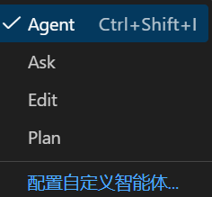

本文档介绍菜单中常见的功能项：

***

### Ask

**用途：进行问答与解释。**

Copilot 的 Ask 模式用于回答问题、解释代码、给出建议等。适合在 IDE 中快速获取帮助，而不改变现有代码。

==对于这里我建议使用内嵌聊天的功能==
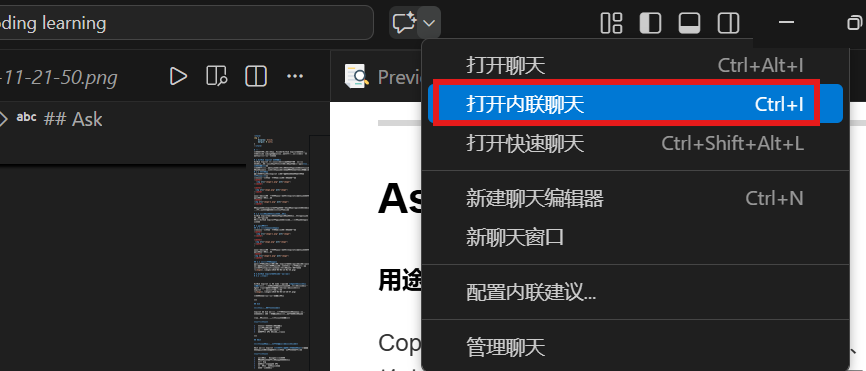
**典型用途：**

*   解释当前文件或函数的功能
*   展示某段代码的性能问题
*   给出实现某个功能的思路
*   询问某个 API 或库的使用方法

***

### Edit

**用途：对代码进行修改（最常用的智能体）。**

Edit 模式让 Copilot **直接改动你正在编辑的代码**，无需切换到聊天窗口。你可以用自然语言描述想要的改动。

**典型用途：**

*   给函数添加 Doxygen/注释文档
*   重构代码（拆分函数、提取变量等）
*   修复 bug
*   将代码迁移到新的 API
*   添加错误检查或边界处理
*   优化性能或可读性

**使用方式示例：**

在代码中选中一段文本 → Agent → Edit → 输入如：

    Rewrite this function to be safer and add error handling.

***

### Plan

**用途：生成任务步骤或处理多阶段请求。**

Plan 模式用于让 Copilot 生成一份“行动计划”或“分步骤任务”，适合更复杂的需求，会先生成一个 roadmap，然后允许你逐步执行。

**典型用途：**

*   为一个功能生成完整的开发计划
*   拆分一个大型 refactor 任务
*   生成项目搭建步骤
*   为一组测试生成覆盖计划
*   为文档编写提供结构化大纲

Plan 不会立即修改代码，而是先“规划 → 你确认 → 执行”。

***

### 配置自定义智能体（Configure Custom Agents…）

**用途：创建属于自己的 Copilot Agent。**

这是 Copilot 的高级功能，允许你编写自己的智能体脚本，让它拥有：

*   可访问工作区文件
*   可运行工具/脚本
*   可调用 API
*   可执行自动化任务
*   可生成定制代码或文档
*   可进行批处理或流程化工作

**常见场景示例：**

*   企业内部文档生成智能体
*   自定义代码审核 Agent
*   安全扫描 Agent
*   项目模板生成器
*   API 说明文档补全器
*   C 语言注释/风格检查自动化 Agent

你可以编写自己的 `agent.yaml` 来扩展 VS Code 的 Copilot 功能。

***

## 总结

| 菜单项          | 作用                   | 是否修改代码   |
| ------------ | -------------------- | -------- |
| **Ask**      | 解释、问答、建议             | ❌ 不改代码   |
| **Edit**     | 直接修改代码               | ✅ 会改代码   |
| **Plan**     | 生成任务计划               | ❌ 不直接改代码 |
| **配置自定义智能体** | 创建属于你的 Copilot Agent | 取决于自定义逻辑 |

## 4.2 内置斜杠命令
在文本框中输入“/”（斜杠），即可看到如图所示的虚拟下拉列表，其中包含用于定义操作意图的内置斜杠命令。
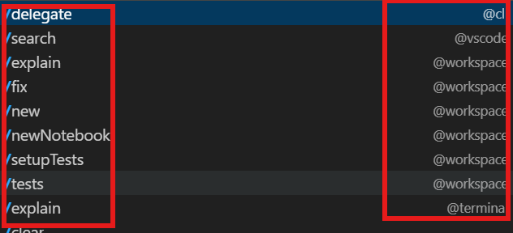
这些内置命令可以认为是一种快捷命令。对此，我总结成一个表格。

| 斜杠命令                  | 功能说明                                  | 典型用途                    |
| --------------------- | ------------------------------------- | ----------------------- |
| **/delegate**         | 将当前请求委托给特定的 Copilot Agent             | 交给某个自定义 Agent 处理任务      |
| **/search**           | 在当前工作区搜索代码，并基于搜索结果回答                  | 查询某个函数在哪、查找调用链          |
| **/explain**          | 解释代码片段或文件的逻辑                          | 理解陌生代码、快速阅读他人代码         |
| **/fix**              | 修复代码中的错误或潜在问题                         | 修 bug、自动修改问题代码          |
| **/new**              | 创建新文件或新代码模板                           | 创建新模块、新组件、快速起草代码        |
| **/newNotebook**      | 创建一个 Jupyter Notebook                 | 数据分析、Python 教学、Demo     |
| **/setupTests**       | 自动生成测试框架或测试文件                         | 快速创建测试环境（如 Jest、pytest） |
| **/tests**            | 为选定代码生成单元测试                           | 自动编写测试用例                |
| **/explain**（列表中重复）   | 解释代码                                  | 通常与上方同义，可能来自不同 Agent    |
| **/clear**            | 清除当前聊天上下文                             | 开始新的对话、避免旧上下文干扰         |
| **/optimize**（部分版本存在） | 对选中代码进行优化                             | 性能优化、结构优化               |
| **/doc**（部分版本存在）      | 自动生成文档注释（如 Doxygen / JSDoc / XML doc） | 自动补全注释、生成 API 文档        |

# 5.探索MCP与GitHub Copilot编码助手
本章将介绍模型上下文协议（MCP）及其对人工智能辅助开发带
来的革命性影响。
 我们将剖析GitHub官方MCP服务器，理解其如何实现AI应用与GitHub生态的无缝集成，并结合实际应用场景探索自主运行的GitHub Copilot编码助手这一新兴领域。
## 5.1 模型上下文协议（MCP）入门指南
模型上下文协议（MCP）是由Anthropic创建的开源开放标准协议，用于规范大型语言模型（LLM）与外部系统及数据源的连接方式。MCP彻底改变了人工智能应用与外部系统的交互模式。 简而言之，可将MCP视为AI应用的"USB-C标准"。正如USB-C为设备连接各类外设提供了标准化方案，MCP同样为AI模型对接不同数据源与工具建立了通用**标准。**
MCP出现前，将AI应用连接至外部工具/API极为复杂。假设您拥有3个不同AI
应用（如Cursor、Claude桌面版、聊天机器人），且每个应用需连接4项不同服务
（如GitHub、PostgreSQL数据库、Google云端硬盘及Slack消息发送API）。 在缺
乏标准连接方式 的情况下，开发者最终需构建12个独立集成方案（3个AI应用 ×
4项服务 = 12个集成），不仅浪费时间、重复编写代码，更带来整体糟糕的开发体验。采用MCP作为标准协议后，您现在可以为每项服务创建一个统一连接器的MCP服务器。无需构建12个独立集成方案，仅需搭建4台MCP服务器（每项服务对应一台）。所有AI应用均连接至中央MCP协议层，该层将请求转发至相应服务。图展示了采用MCP协议与未采用MCP协议时所需创建的集成方案。
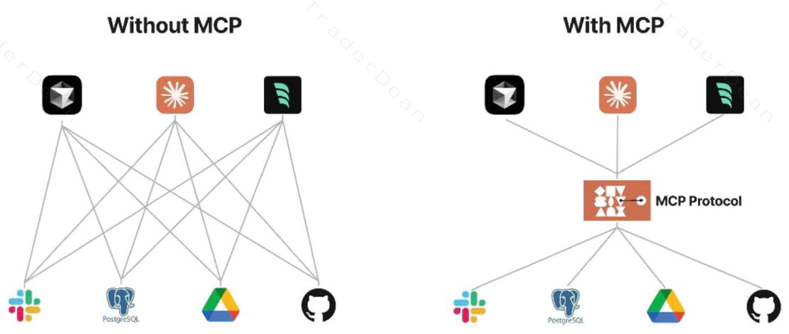
| 组件             | 作用                                         |
| -------------- | ------------------------------------------ |
| **MCP Host**   | 包含 LLM 的宿主环境，如 IDE、Copilot、Chat UI。        |
| **MCP Client** | Host 内部的桥梁层，负责把 LLM 的请求转换为标准协议格式。          |
| **MCP Server** | 外部数据源或工具的提供者，如 GitHub、Slack、数据库、文件系统。      |
| **Transport**  | 通信层，使用 JSON-RPC 2.0，通过 stdin/stdout 或 SSE。 |

## 5.2 GitHub 官方 MCP 服务器
官方文档链接：<https://github.com/github/github-mcp-server>

### 5.2.1 搭建远程 GitHub MCP 服务器

#### 1. 准备工作
- 确保已安装 VS Code
- 确保已安装 GitHub Copilot 扩展
- 确保有 GitHub 账号并已在 VS Code 中登录

#### 2. 配置 MCP 服务器(本地可用)
可以参考vscode官网对mcp配置的教学：<https://vscode.js.cn/docs/copilot/customization/mcp-servers>
在 VS Code 用户设置中添加 MCP 配置文件

**文件位置：** `C:\Users\{用户名}\AppData\Roaming\Code\User\mcp.json`

**配置内容：**
```json
{
	"servers": {
		"github": {
			"type": "http",
			"url": "https://api.githubcopilot.com/mcp/"
		}
	},
	"inputs": []
}
```
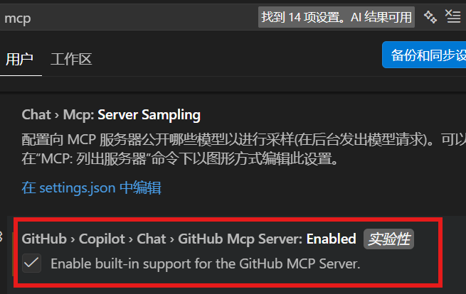
| MCP Server | 用途 | 类型 | 官方链接 |
| --- | --- | --- | --- |
| **github-mcp-server** | 与 GitHub 集成，查询仓库、Issue、PR、工作流等 | 官方 | [github-mcp-server](https://github.com/github/github-mcp-server) |
| **postgres-mcp-server** | 连接 PostgreSQL 数据库，执行查询和数据操作 | 官方 | [postgres-mcp-server](https://github.com/modelcontextprotocol/servers/tree/main/src/postgres) |
| **sqlite-mcp-server** | 连接 SQLite 数据库 | 官方 | [sqlite-mcp-server](https://github.com/modelcontextprotocol/servers/tree/main/src/sqlite) |
| **filesystem-mcp-server** | 访问本地文件系统，读写文件 | 官方 | [filesystem-mcp-server](https://github.com/modelcontextprotocol/servers/tree/main/src/filesystem) |
| **slack-mcp-server** | 与 Slack 集成，发送消息、查询频道、管理工作区 | 官方 | [slack-mcp-server](https://github.com/modelcontextprotocol/servers/tree/main/src/slack) |
| **google-drive-mcp-server** | Google 云端硬盘集成，查询和管理文件 | 官方 | [google-drive-mcp-server](https://github.com/modelcontextprotocol/servers/tree/main/src/google-drive) |
| **fetch-mcp-server** | 发送 HTTP 请求，获取网页内容 | 官方 | [fetch-mcp-server](https://github.com/modelcontextprotocol/servers/tree/main/src/fetch) |
| **memory-mcp-server** | 为 AI 提供持久化内存存储 | 官方 | [memory-mcp-server](https://github.com/modelcontextprotocol/servers/tree/main/src/memory) |
| **brave-search-mcp-server** | 使用 Brave Search API 进行网络搜索 | 官方 | [brave-search-mcp-server](https://github.com/modelcontextprotocol/servers/tree/main/src/brave-search) |
| **npm-mcp-server** | NPM 包管理集成，查询包信息 | 官方 | [npm-mcp-server](https://github.com/modelcontextprotocol/servers/tree/main/src/npm) |
| **azure-mcp-server** | Microsoft Azure 云平台集成 | 社区 | [azure-mcp-server](https://github.com/Azure/azure-mcp-server) |
| **docker-mcp-server** | Docker 容器管理和操作 | 社区 | [docker-mcp-server](https://github.com/kp-forks/docker-mcp-server) |
| **git-mcp-server** | Git 版本控制操作（提交、分支、日志等） | 社区 | [git-mcp-server](https://github.com/modelcontextprotocol/servers/tree/main/src/git) |
| **linear-mcp-server** | Linear 项目管理集成 | 社区 | [linear-mcp-server](https://github.com/modelcontextprotocol/servers/tree/main/src/linear) |
| **jira-mcp-server** | Jira 项目管理集成 | 社区 | [jira-mcp-server](https://github.com/jomplerot/mcp-jira-server) |
| **notion-mcp-server** | Notion 笔记和数据库集成 | 社区 | [notion-mcp-server](https://github.com/daoxian/mcp-notion-server) |

### 5.2.2 调用MCP server
下面是 **“如何在 VS Code 的 GitHub Copilot 中调用 MCP”** 的 **总结版表格（Markdown 格式）**，清晰展示 3 种调用方式及其场景，非常适合放入文档或团队知识库。

***

**📘 VS Code 中调用 MCP 的方式一览表**

| 调用方式                                     | 示例                              | 适用场景                                    | 特点                                                        |
| ---------------------------------------- | ------------------------------- | --------------------------------------- | --------------------------------------------------------- |
| **1. 直接 @ 调用 MCP Server**                | `@github-fs read /README.md`    | 明确知道要使用哪个 MCP Server 时                  | 最直接、最可控，自动补全所有服务器名称                                       |
| **2. 使用 `/delegate` 让 Copilot 代理调用 MCP** | `/delegate @github-fs` → 继续输入任务 | 想让 MCP Server 执行任务，但仍希望 Copilot 帮你处理上下文 | Copilot 会将任务委托给指定 MCP，并负责组织输入输出                           |
| **3. 自然语言（由 Copilot 自动选择 MCP Server）**   | “帮我读取当前仓库的 README 文件”           | 不关心用哪个 MCP Server，只想完成任务                | Copilot 会自动选择最合适的 MCP Server（如 GitHub FS / GitHub Issues） |

***

 📌 补充说明（适合写入文档）

*   输入 **`@`** 时，下拉列表会自动列出已安装的 MCP 服务器。
*   MCP Server 必须先通过命令安装：
        Ctrl + Shift + P → GitHub MCP: Install Remote Server
*   首次使用 GitHub 系相关 MCP 时需完成 OAuth 授权。
*   所有调用方式最终都依赖 VS Code 中注册的 MCP 客户端与服务器通信。

==ctrl+shift+p，打开命令行，输入MCP: List Servers,可查看配置的MCP==
***
## 5.3 从0开始编写MCP服务器(工作区可用)
模型上下文协议（MCP）为多种语言提供官方软件开发工具包（SDK），包括Java、C#、TypeScript、Python、Kotlin、Swift和Rust。
**可以理解成一个框架，在这框架下写程序，除了业务逻辑之外的固定的部分都是重复的**
有关 C# SDK 的更多详情，请参阅https://github.com/modelcontextprotocol/csharp-sdk。
借助SDK，开发者现可构建基于该协议的服务器与客户端。使用 SDK 能简化实现过程，使您专注于应用功能而非协议处理的复杂性。该 SDK 既支持调用MCP 服务器，也支持创建能与 MCP 服务器交互的健壮客户端应用。自己配置本地MCP server其实就是：
1.写实现功能的代码
2.加到mcp.json文件

其实MCP server本质上来说就是一个程序，一些代码。
前期准备是我们要配置好基础的MCP server的环境，就是刚才不说了嘛，MCP server本质上就是一个代码文件嘛，所以你一定得有环境，那么可以用了变现MCP server的语言也是有限的。

### 5.3.1 示例
这里就用最熟悉的Python语言编写，MCP server。
python的配置大家去官网或者找找教学，全网都有，不必多说；
uv的配置，去官网<https://hellowac.github.io/uv-zh-cn/getting-started/installation/>然后去找安装命令，在powershell里面复制粘贴命令即可：
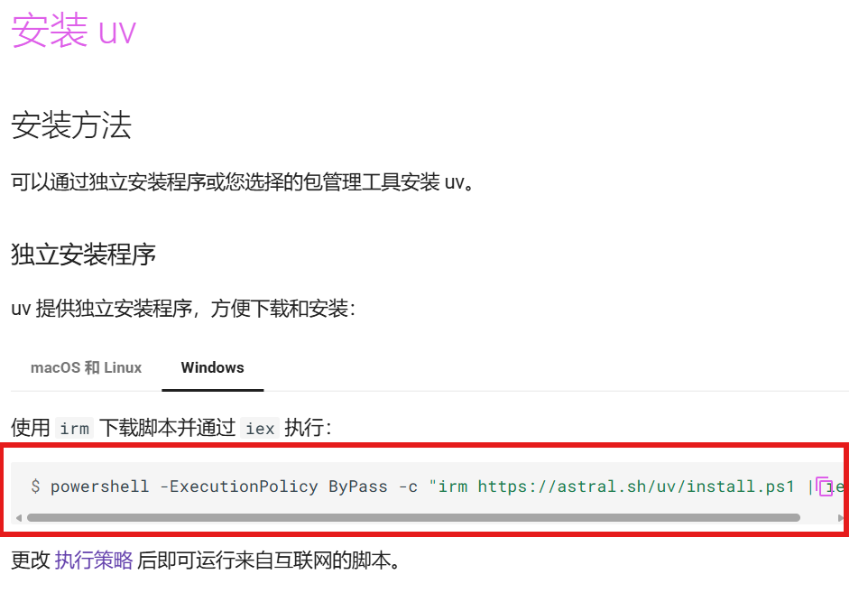


==**安装后记得重启vscode**==
2.建议先搭建工程+激活个venv虚拟环境：
```
PS D:\MCP server> uv init weather//初始化工程
Initialized project `weather` at `D:\MCP server\weather`
PS D:\MCP server> uv venv//创建虚拟环境
Using CPython 3.14.3
Creating virtual environment at: .venv
Activate with: .venv\Scripts\activate//激活虚拟环境
PS D:\MCP server> .\.venv\Scripts\activate

```

`uv init weather//初始化工程`
`uv venv//创建虚拟环境`
`.venv\Scripts\activate//激活虚拟环境`

看一下这个python工程里面包含的内容是啥：
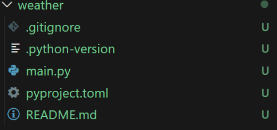
weather/          ← 项目主文件夹（可能包含业务逻辑）
.gitignore        ← Git 忽略规则文件
.python-version   ← 指定本项目使用的 Python 版本
main.py           ← 主程序入口文件
pyproject.toml    ← 项目配置与依赖管理文件（PEP 621 / PEP 518）
README.md         ← 项目说明文档

3.Add MCP SDK：项目文件在 weather 子目录中。**你需要切换到该目录，或者指定路径运行命令：**`cd "d:\MCP server\weather" && uv add "mcp[cli]"`
用**本地STDIO：** 表示客户端（AI 助手）与该 Server 之间的通信方式是通过 标准输入输出流 进行的。
输入: AI 助手将 JSON-RPC 消息写入 Server 进程的 stdin。
输出: Server 进程将响应消息打印到 stdout。
错误: 日志或错误信息通常输出到 stderr。
从<https://github.com/modelcontextprotocol/python-sdk?tab=readme-ov-file#installation>网站找到以下代码到你的main.py文件：
```python
"""
FastMCP quickstart example.

Run from the repository root:
    uv run examples/snippets/servers/fastmcp_quickstart.py
"""

from mcp.server.fastmcp import FastMCP

# Create an MCP server
mcp = FastMCP("Demo", json_response=True)


# Add an addition tool
@mcp.tool()
def add(a: int, b: int) -> int:
    """Add two numbers"""
    return a + b


# Add a dynamic greeting resource
@mcp.resource("greeting://{name}")
def get_greeting(name: str) -> str:
    """Get a personalized greeting"""
    return f"Hello, {name}!"


# Add a prompt
@mcp.prompt()
def greet_user(name: str, style: str = "friendly") -> str:
    """Generate a greeting prompt"""
    styles = {
        "friendly": "Please write a warm, friendly greeting",
        "formal": "Please write a formal, professional greeting",
        "casual": "Please write a casual, relaxed greeting",
    }

    return f"{styles.get(style, styles['friendly'])} for someone named {name}."


# Run with streamable HTTP transport
if __name__ == "__main__":
    mcp.run(transport="streamable-http")
```
这段代码是一个基于 **FastMCP**（Model Context Protocol 的一种快速开发封装）的示例脚本。它展示了一个 MCP Server 的核心三要素：**工具 (Tools)**、**资源 (Resources)** 和 **提示词 (Prompts)**，并配置为使用 **HTTP** 协议运行。

以下是详细的代码分析和运行指南：

 **1. 代码核心功能分析**

**🛠️ 1. 初始化服务器**
```python
mcp = FastMCP("Demo", json_response=True)
```
- 创建了一个名为 `"Demo"` 的 MCP 服务实例。
- `json_response=True`：强制服务器以 JSON 格式返回响应（通常用于调试或特定客户端兼容性）。

 **➕ 2. 定义工具 (Tool) - `add(里面的函数内容当然可以自定义)`**
```python
@mcp.tool()
def add(a: int, b: int) -> int:
    """Add two numbers"""
    return a + b
```
- **作用**：让 AI 模型能够执行数学加法。
- **机制**：装饰器 `@mcp.tool()` 会自动读取函数签名（参数类型 `int`）和文档字符串（`"""Add two numbers"""`），将其注册为 MCP 协议中的 `tool`。
-== **AI 视角**：AI 会看到：“我有一个叫 `add` 的工具，需要两个整数参数，用于计算和。”==
==这个AI视角非常重要,你后面用自然语言和ai对话的时候,ai判断你是否调用这个add tool就是根据你这个注释判断==

**📄 3. 定义资源 (Resource) - `get_greeting`**
```python
@mcp.resource("greeting://{name}")
def get_greeting(name: str) -> str:
    """Get a personalized greeting"""
    return f"Hello, {name}!"
```
- **作用**：提供动态内容读取能力。
- **URI 模板**：`greeting://{name}` 是一个模板。当 AI 请求 `greeting://Alice` 时，`name` 参数会被自动提取并传入函数。
- **AI 视角**：AI 知道它可以读取 `greeting://...` 形式的 URI 来获取问候语。

**💬 4. 定义提示词 (Prompt) - `greet_user`**
```python
@mcp.prompt()
def greet_user(name: str, style: str = "friendly") -> str:
    # ... 逻辑 ...
    return f"{styles.get(style, styles['friendly'])} for someone named {name}."
```
- **作用**：为 AI 提供预定义的指令模板，帮助 AI 更好地生成回复。
- **参数**：支持必填参数 `name` 和可选参数 `style`（默认 "friendly"）。
- **AI 视角**：当用户说“给 Alice 写个问候”时，AI 可以调用这个 prompt 模板，获取具体的系统指令（例如：“Please write a warm, friendly greeting for someone named Alice”），从而生成更高质量的回答。

**🌐 5. 启动方式 (Transport)**
```python
if __name__ == "__main__":
mcp.run(transport="streamable-http")
```
>第 1 行 if __name__ == "__main__":：
Python 的标准写法。确保只有当直接运行这个文件（python file.py 或 uv run file.py）时，下面的代码才会执行。
如果这个文件被其他模块 import 进来，这里的代码不会运行（防止意外启动服务器）。
- **关键点**：这里使用的是 `streamable-http`，而不是之前讨论的 `stdio`。
- **含义**：服务器将作为一个 **HTTP 服务** 运行，监听某个端口（默认通常是 `8000` 或由环境变量指定），支持 SSE (Server-Sent Events) 流式传输。
- **适用场景**：适合远程部署、Docker 容器化运行，或者客户端与服务器不在同一台机器的情况。


**==这边启动方式先更改成stdio协议==**

---
我这边是要创建一个查询天气的MCP server，粘贴到main.py：
```python

from typing import Any
import httpx
from mcp.server.fastmcp import FastMCP


# Initialize FastMCP server
mcp = FastMCP("weather", log_level="ERROR")


# Constants
NWS_API_BASE = "https://api.weather.gov"
USER_AGENT = "weather-app/1.0"


async def make_nws_request(url: str) -> dict[str, Any] | None:
    """Make a request to the NWS API with proper error handling."""
    headers = {
        "User-Agent": USER_AGENT,
        "Accept": "application/geo+json"
    }
    async with httpx.AsyncClient() as client:
        try:
            response = await client.get(url, headers=headers, timeout=30.0)
            response.raise_for_status()
            return response.json()
        except Exception:
            return None


def format_alert(feature: dict) -> str:
    """Format an alert feature into a readable string."""
    props = feature["properties"]
    return f"""
Event: {props.get('event', 'Unknown')}
Area: {props.get('areaDesc', 'Unknown')}
Severity: {props.get('severity', 'Unknown')}
Description: {props.get('description', 'No description available')}
Instructions: {props.get('instruction', 'No specific instructions provided')}
"""


@mcp.tool()
async def get_alerts(state: str) -> str:
    """Get weather alerts for a US state.

    Args:
        state: Two-letter US state code (e.g. CA, NY)
    """
    url = f"{NWS_API_BASE}/alerts/active/area/{state}"
    data = await make_nws_request(url)

    if not data or "features" not in data:
        return "Unable to fetch alerts or no alerts found."

    if not data["features"]:
        return "No active alerts for this state."

    alerts = [format_alert(feature) for feature in data["features"]]
    return "\n---\n".join(alerts)


@mcp.tool()
async def get_forecast(latitude: float, longitude: float) -> str:
    """Get weather forecast for a location.

    Args:
        latitude: Latitude of the location
        longitude: Longitude of the location
    """
    # First get the forecast grid endpoint
    points_url = f"{NWS_API_BASE}/points/{latitude},{longitude}"
    points_data = await make_nws_request(points_url)

    if not points_data:
        return "Unable to fetch forecast data for this location."

    # Get the forecast URL from the points response
    forecast_url = points_data["properties"]["forecast"]
    forecast_data = await make_nws_request(forecast_url)

    if not forecast_data:
        return "Unable to fetch detailed forecast."

    # Format the periods into a readable forecast
    periods = forecast_data["properties"]["periods"]
    forecasts = []
    for period in periods[:5]:  # Only show next 5 periods
        forecast = f"""
{period['name']}:
Temperature: {period['temperature']}°{period['temperatureUnit']}
Wind: {period['windSpeed']} {period['windDirection']}
Forecast: {period['detailedForecast']}
"""
        forecasts.append(forecast)

    return "\n---\n".join(forecasts)


if __name__ == "__main__":
    # Initialize and run the server
    mcp.run(transport='stdio')

```

这些配置好了后，我们创建一个.vscode文件夹，然后在这个文件夹里面创建文件mcp.json。
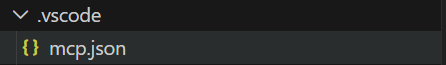
然后在mcp.json文件里面粘贴：
```python
{
	"servers": {
		"weather": {
			"type": "stdio",
			"command": "uv",
			"args": [
				"--directory",
				"C:\\Users\\Z0328928\\OneDrive - ZF Friedrichshafen AG\\Desktop\\Vibe coding learning\\MCP server\\weather",
				"run",
				"python",
				"-u",
				"main.py"
			]
		}
	},
	"inputs": []
}
```

这个时候在界面的右下角会出现：
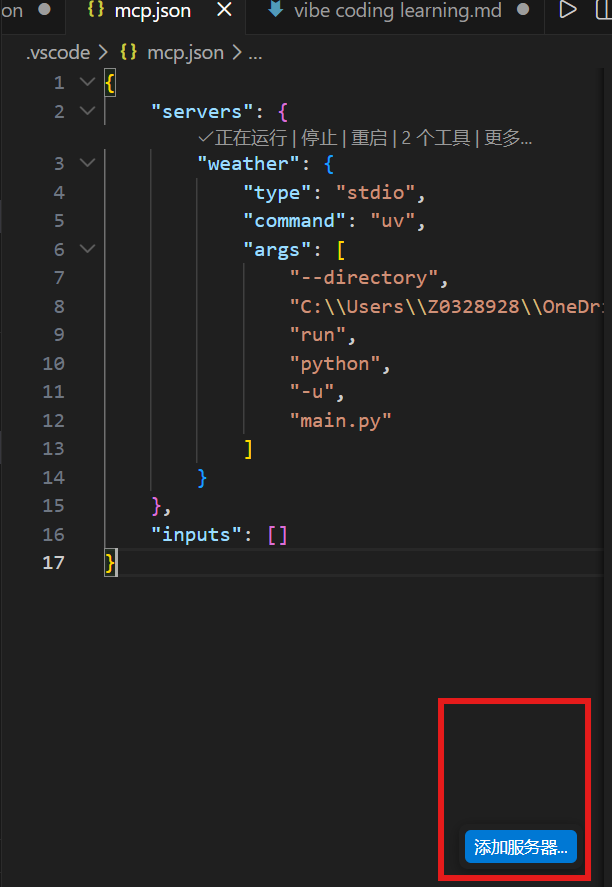
点击出现：
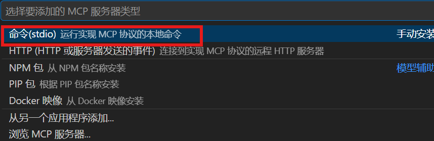
接着：
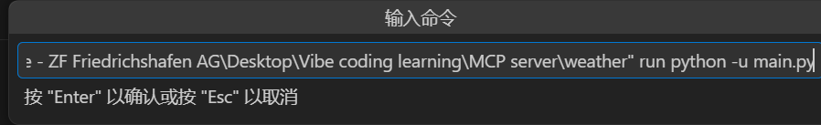
那么这里的命令就是刚才粘贴的mcp格式的单行格式：
`uv --directory "C:\Users\Z0328928\OneDrive - ZF Friedrichshafen AG\Desktop\Vibe coding learning\MCP server\weather" run python -u main.py`
然后你再输入服务器id。服务器id也有规矩：
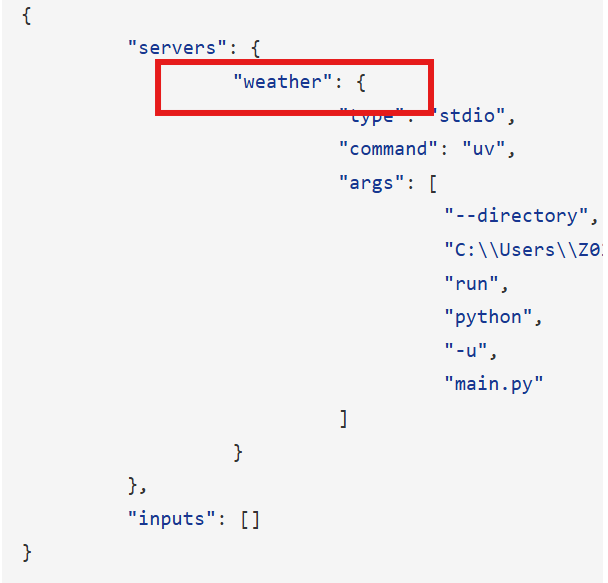
然后就运行起来了，这个mcp，我们在命令的输入框输入；>MCP：list servers
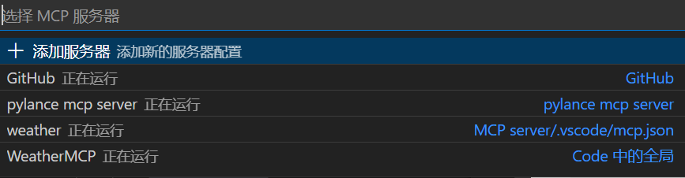
然后用自然语言测试调用mcp：
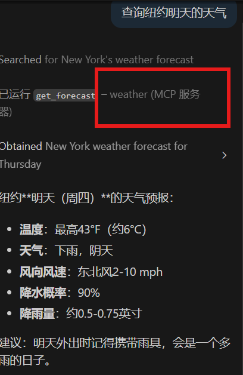

# 6.SKILL创建
举个例子，如果你每天完成编辑，你都想让Github Copilot做一个总结，如果你每次都是用命令来做的话，比较麻烦，这个时候Agent Skill出场了，可以类比为给大模型的说明书。
1. 在您的工作区中创建 `.github/skills` 目录。

2. 为您的技能创建一个子目录。每个技能应有自己的目录（例如 `.github/skills/webapp-testing`）。

3. 在技能目录中创建一个 `SKILL.md` 文件，其中包含以下结构：
```markdown
---
name: skill-name
description: Description of what the skill does and when to use it
---
```

一个大型的skill的话包含的元素：
 **Reference**：但是有的时候，我举个例子，比如说我设计一个会议总结助手，当涉及到合同时，我需要标注合同内容是否合法规，那我按照道理我需要在SKILL.md文件里面上传全部的法律法规。但我如果不涉及到合同内容的会议总结，我也加载一遍法律法规是否过于麻烦？这里引出 **“Reference”**的功能。操作步骤如下：
1.新建一个文件————集团财务手册.md，和SKILL.md同一个目录下，或者官方建议将 Reference 归类至 references/ 文件夹（references/和SKILL.md在同一目录），Script 归类至 scripts/ 文件夹，以保持结构清晰。
2.在SKILL.md文件中加入以下内容：
- **财务提醒**：仅在提到“钱、预算、采购、费用”时触发。  
  须读取 [`集团财务手册.md`](集团财务手册.md)，指出决定中的金额是否超标，并明确审批人。
3.依旧是重启使用功能，然后正常发送会议记录.txt，Claude Code自动给你识别应该使用Skill了。

 **Script**：如果我们需要利用Agent Skill写代码就得利用这个，比如说我想要把这个会议内容上传到服务器里面去，那么我就得准备一个upload.py脚本：
 1.写一个upload.py的脚本放到和SKILL.md同一目录下，或者官方建议将 Reference 归类至 references/ 文件夹（references/和SKILL.md在同一目录），Script 归类至 scripts/ 文件夹，以保持结构清晰。
 **Asset**：（资产） 角色是 “脚本执行所依赖的静态资源、配置文件或模板”。

如果说 `Script` (upload.py) 是**“动作”**（怎么上传），那么 `Asset` 就是**“工具包”或“通行证”**（上传需要什么配置、上传成什么格式）。

按照官方建议的结构，比如说一个 `daily-report` Skill 目录应该是这样的：

```text
~/.github/skills/daily-report/
├── SKILL.md                # 【核心说明书】定义触发条件、逻辑流程
├── references/             # 【参考知识库】
│   └── 集团财务手册.md     # 用于判断金额合规性
├── scripts/                # 【执行逻辑】
│   └── upload.py           # 负责执行上传动作的代码
└── assets/                 # 【依赖资源/资产】 <--- 这里放 Asset
    ├── config.json         # 服务器配置 (Asset 1)
    ├── report_template.html# 报告模板 (Asset 2)
    └── department_codes.csv# 部门映射表 (Asset 3)
```
## 具体SKILL.md的格式
| 字段 (Field)              | 必填 (Required) | 描述 (Description) |
|---------------------------|------------------|----------------------|
| name                      | Yes              | 技能的唯一标识符。必须为小写，使用连字符表示空格（例如：webapp-testing）。必须与父目录名称一致。最大长度 64 个字符。 |
| description               | Yes              | 描述技能的功能以及**何时使用**它。请明确功能和使用场景，以帮助 Copilot 决定何时加载该技能。最大长度 1024 个字符。 |
| argument-hint             | No               | 当技能作为斜杠命令（slash command）调用时，在聊天输入框中显示的提示信息。帮助用户了解需要提供哪些额外信息（例如：`[test file] [options]`）。 |
| user-invocable            | No               | 控制技能是否在聊天菜单中以斜杠命令形式出现。默认值为 `true`。设为 `false` 时会从 `/` 菜单中隐藏该技能，但代理仍能自动加载它。 |
| disable-model-invocation  | No               | 控制代理是否可以基于相关性自动加载该技能。默认值为 `false`。设为 `true` 时，仅可通过斜杠命令手动调用该技能。 |

再具体解释一下后三个的内容：
| 字段 (Field)               | 它是什么                       | 解决的问题                         |
|----------------------------|--------------------------------|-------------------------------------|
| argument-hint              | 输入框提示文字                 | 用户不知道这个命令需要哪些参数     |
| user-invocable             | 是否显示在 `/` 菜单            | 用户需不需要手动点击这个技能       |
| disable-model-invocation   | Copilot 是否能自动调用         | 是否允许模型自动触发技能           |

## 示例
```markdown
---
name: daily-report
description: >
  当用户请求“写每日总结”或“上传会议记录”时触发。技能将执行三项任务：
  (1) 读取参考文档 references/集团财务手册.md，对内容进行预算与费用相关的合规检查；
  (2) 使用 assets/report_template.html 将总结内容格式化为 HTML；
  (3) 通过 scripts/upload.py 上传生成的报告文件，并使用 assets/config.json 中的配置完成认证。
  若缺失 config.json，则提示用户配置服务器信息。
argument-hint: "[input_file] [options]"
user-invocable: true
disable-model-invocation: false
---
```


| 字段 (Field)             | 内容来源说明                                                                      |
|--------------------------|------------------------------------------------------------------------------------|
| name                     | 使用唯一标识符 daily-report（全部小写、连字符分隔、≤64 字符）                    |
| description              | 把你原来的触发条件 + 执行流程 + 约束合并成一个 1024 字符以内的说明，并明确“何时使用” |
| argument-hint            | 给出一个 Chat 输入提示，用于引导用户输入 /daily-report [input_file]              |
| user-invocable           | 设为 true，让用户可在 `/` 菜单中看到 /daily-report                                |
| disable-model-invocation | 保持 false，允许 Copilot 根据“写总结”等请求自动触发                              |

目录结构如下：
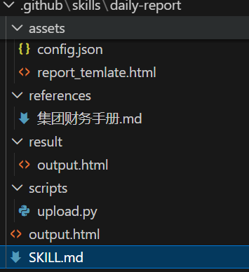
==以上是手动在项目文件里面配置skill，这样子能完美运行，但是无法通过斜杠命令唤醒，vscode提供了更牛逼的方式，非常方便去做一个skill==
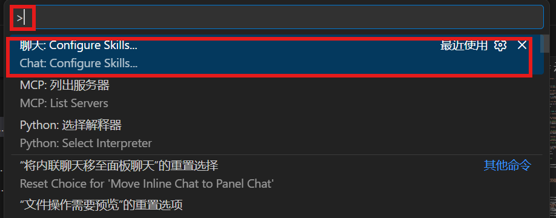
然后：
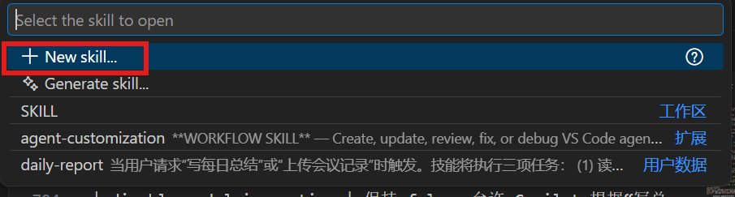
然后：
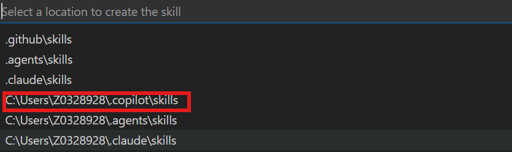
然后：
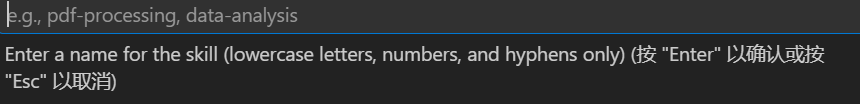
然后他直接跳出来框架：
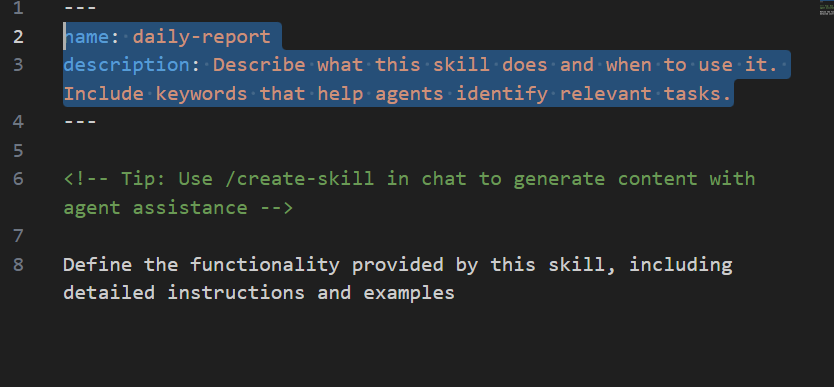
然后就可以在chat对话框用斜杠命令了：
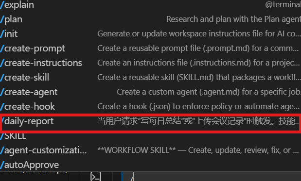

# 7.用于软件开发全流程
## 软件开发活动概述

| 活动类型                          | 目的 / 描述                             | 典型收益                       | 适用场景                            |
| ----------------------------- | ----------------------------------- | -------------------------- | ------------------------------- |
| **快速原型开发（Rapid Prototyping）** | 快速构建一个小型、可运行的原型，用于验证想法或探索可行性。       | 快速反馈、降低风险、提前验证用户体验与架构方案。   | 项目早期、设计探索、头脑风暴、概念验证（POC）阶段。     |
| **功能开发（Feature Development）** | 根据需求、用户故事或规范实现新功能。                  | 增加面向用户的价值、扩展产品能力。          | 迭代开发、功能里程碑、需求落地阶段。              |
| **代码重构（Refactoring）**         | 在不改变功能行为的前提下，改进代码结构、可读性或性能。         | 更易维护、扩展性更好、技术债减少、代码质量提升。   | 当代码难以修改、技术债累积，或在修改相关功能时顺手改进。    |
| **测试（Testing）**               | 创建和运行各种类型的测试（单元、集成、端到端），以验证正确性与稳定性。 | 提前发现问题、提高发布质量、增强信心、降低回归风险。 | 版本发布前、开发新功能后、CI/CD 阶段、需要确保质量时。  |
| **代码评审（Code Reviews）**        | 对代码变更进行检查，确保正确性、风格一致性、安全性和可维护性。     | 团队知识共享、减少缺陷、提高代码质量、统一标准。   | Pull Request 阶段、新成员加入团队、质量把控过程。 |


